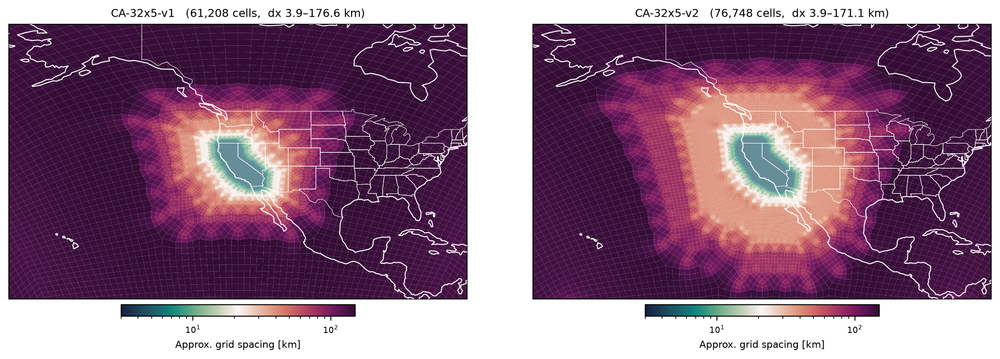

# STRONG: Simulation of weather Threats to advance a Resilient and Optimized National Grid  

This project is focused on using "ensemble boosting" to simulate extreme heatwaves over california and then using dynamical downscaling (via EAMxx w/ RRM) to study local effects on the electricity grid.

--------------------------------------------------------------------------------

# RRM Grids

We are currently planning to rely on nudging with EAMxx to downscale an event simulated by a low-res E3SMv3 case, so we can afford to keep a very low-res grid outside of the region of interest. Two refined grids were created focused on California. In Both cases the base resolution in ne32, with a 5x refinement to bring the finest resolution to ~3km/5km in the dycor/physics grid, similar to ne1024pg2. Additional grids were considered that used a ne128x3 to have finer resolution outside of california, but we don't anticipate using those.

The refinement region is created by outlining the state boundaries and then expanding this away from the coast with a blurring technique. The "v2" grid also includes an intermediate "buffer" region. We only plan on using the "v1" grid since we are planning to rely on nudging, so then we can focus mainly on the localized impact of the event that can inform our electricity grid model.



--------------------------------------------------------------------------------

# Grid Creation Notes

The RRM grid is created by first generating a PNG file with `generate_refinement_image.py` that shades the state of california. The `generate_grids.py` script then runs SQuadGen and the TempestRemap tools for each grid declared with `add_grid()` — all paths are taken from `project.yaml`, so nothing needs to be edited when switching machines. The `plot.grid.py` script can then be used to visual one of more grids for comparison. All of these scripts should be reviewed and modified before running.

The general grid generation workflow is as follows:

```shell
python generate_refinement_image.py
python generate_grids.py
python plot.grid.py
```

Below are the original SQuadGen commands and variations that I used prior to writing the generate_grids.py script to automate the grid generation task.

```shell

# DATA_ROOT=/global/cfs/cdirs/m5277/whannah/2026-STRONG-CA
DATA_ROOT=/lustre/orion/cli115/proj-shared/hannah6/TAOS
GRID_ROOT=${DATA_ROOT}/files_grid
REF_IMAGE_ROOT=~/TAOS/projects/2026-STRONG-CA

mkdir -p ${GRID_ROOT}

REF_IMAGE_V1=${REF_IMAGE_ROOT}/2026-STRONG-CA-RRM_refinement_image_v1.png # w/o halo/buffer region
REF_IMAGE_V2=${REF_IMAGE_ROOT}/2026-STRONG-CA-RRM_refinement_image_v2.png # w/  halo/buffer region

### grid parameters
# BASE_RES=32;REFINE_LVL=5; REF_IMAGE=$REF_IMAGE_V1; GRID_NAME=STRONG-CA-${BASE_RES}x${REFINE_LVL}-v1 # ne32 => ne1024
# BASE_RES=32;REFINE_LVL=5; REF_IMAGE=$REF_IMAGE_V2; GRID_NAME=STRONG-CA-${BASE_RES}x${REFINE_LVL}-v2 # ne32 => ne1024

# BASE_RES=128;REFINE_LVL=3; REF_IMAGE=$REF_IMAGE_V1; GRID_NAME=STRONG-CA-${BASE_RES}x${REFINE_LVL}-v1 # ne128 => ne1024
# BASE_RES=128;REFINE_LVL=3; REF_IMAGE=$REF_IMAGE_V2; GRID_NAME=STRONG-CA-${BASE_RES}x${REFINE_LVL}-v2 # ne128 => ne1024

SQuadGen --refine_file ${REF_IMAGE} --resolution ${BASE_RES} --refine_level ${REFINE_LVL} \
--refine_type LOWCONN --smooth_type SPRING --smooth_dist 10 --smooth_iter 20 \
--lon_ref 240 --lat_ref 38 --output ${GRID_ROOT}/${GRID_NAME}.g
GenerateVolumetricMesh --in ${GRID_ROOT}/${GRID_NAME}.g     --out ${GRID_ROOT}/${GRID_NAME}pg2.g --np 2 --uniform
ConvertMeshToSCRIP     --in ${GRID_ROOT}/${GRID_NAME}pg2.g --out ${GRID_ROOT}/${GRID_NAME}pg2_scrip.nc
ls -l ${GRID_ROOT}/${GRID_NAME}*

# Commands to generate uniform (i.e. unrefined) grids for comparison
NE=128
GenerateCSMesh --alt --res ${NE} --file ${GRID_ROOT}/ne${NE}.g
GenerateVolumetricMesh --in ${GRID_ROOT}/ne${NE}.g --out ${GRID_ROOT}/ne${NE}pg2.g --np 2 --uniform
ConvertMeshToSCRIP --in ${GRID_ROOT}/ne${NE}pg2.g --out ${GRID_ROOT}/ne${NE}pg2_scrip.nc

```

# SPA Grid File

```shell
GRID_ROOT=$(python -m taos.config project.yaml derived.grid_root) || exit 1
NE=30
GenerateCSMesh --alt --res ${NE} --file ${GRID_ROOT}/ne${NE}.g
GenerateVolumetricMesh --in ${GRID_ROOT}/ne${NE}.g --out ${GRID_ROOT}/ne${NE}pg2.g --np 2 --uniform
ConvertMeshToSCRIP --in ${GRID_ROOT}/ne${NE}pg2.g --out ${GRID_ROOT}/ne${NE}pg2_scrip.nc
echo ; echo ${GRID_ROOT}/ne${NE}pg2_scrip.nc ; echo
```

--------------------------------------------------------------------------------

<!-- # Prerequisite Steps -->

--------------------------------------------------------------------------------

# E3SM Source Code Changes Needed to Define Grid

## cime_config/config_grids.xml

### XML grid spec

```xml
    <!--=====================================================================-->
    <!-- INCITE 2026 CONUS-RRM -->
    <model_grid alias="conus1024x2v1pg2_RRSwISC6to18E3r5">
      <grid name="atm">ne0np4_conus1024x2v1.pg2</grid>
      <grid name="lnd">ne0np4_conus1024x2v1.pg2</grid>
      <grid name="ocnice">RRSwISC6to18E3r5</grid>
      <grid name="rof">r0125</grid>
      <grid name="glc">null</grid>
      <grid name="wav">null</grid>
      <mask>RRSwISC6to18E3r5</mask>
    </model_grid>
    <!--=====================================================================-->
```

### XML domain spec

```xml

    <!--=====================================================================-->
    <domain name="ne32np4.pg2">
      <nx>24576</nx>
      <ny>1</ny>
      <file grid="atm|lnd" mask="RRSwISC6to18E3r5">$DIN_LOC_ROOT/share/domains/domain.lnd.ne32pg2_RRSwISC6to18E3r5.20251006.nc</file>
      <file grid="ice|ocn" mask="RRSwISC6to18E3r5">$DIN_LOC_ROOT/share/domains/domain.ocn.ne32pg2_RRSwISC6to18E3r5.20251006.nc</file>
      <desc>ne32pg2</desc>
    </domain>
```

### XML map spec

```xml
    <!--=====================================================================-->
    <!-- INCITE 2026 CONUS-RRM  -->
    <!--=====================================================================-->
    <!-- ne32 -->
    <gridmap atm_grid="ne32np4.pg2" ocn_grid="RRSwISC6to18E3r5">
      <map name="ATM2OCN_FMAPNAME"          >cpl/gridmaps/ne32pg2/map_ne32pg2_to_RRSwISC6to18E3r5_traave.20251006.nc</map>
      <map name="ATM2OCN_VMAPNAME"          >cpl/gridmaps/ne32pg2/map_ne32pg2_to_RRSwISC6to18E3r5_trbilin.20251006.nc</map>
      <map name="ATM2OCN_SMAPNAME"          >cpl/gridmaps/ne32pg2/map_ne32pg2_to_RRSwISC6to18E3r5_trbilin.20251006.nc</map>
      <map name="OCN2ATM_FMAPNAME"          >cpl/gridmaps/RRSwISC6to18E3r5/map_RRSwISC6to18E3r5_to_ne32pg2_traave.20251006.nc</map>
      <map name="OCN2ATM_SMAPNAME"          >cpl/gridmaps/RRSwISC6to18E3r5/map_RRSwISC6to18E3r5_to_ne32pg2_traave.20251006.nc</map>
      <map name="ATM2ICE_FMAPNAME_NONLINEAR">cpl/gridmaps/ne32pg2/map_ne32pg2_to_RRSwISC6to18E3r5_trfv2.20251006.nc</map>
      <map name="ATM2OCN_FMAPNAME_NONLINEAR">cpl/gridmaps/ne32pg2/map_ne32pg2_to_RRSwISC6to18E3r5_trfv2.20251006.nc</map>
    </gridmap>
    <gridmap atm_grid="ne32np4.pg2" lnd_grid="r025">
      <map name="ATM2LND_FMAPNAME"          >cpl/gridmaps/ne32pg2/map_ne32pg2_to_r025_traave.20251006.nc</map>
      <map name="ATM2LND_FMAPNAME_NONLINEAR">cpl/gridmaps/ne32pg2/map_ne32pg2_to_r025_trfv2.20251006.nc</map>
      <map name="ATM2LND_SMAPNAME"          >cpl/gridmaps/ne32pg2/map_ne32pg2_to_r025_trbilin.20251006.nc</map>
      <map name="LND2ATM_FMAPNAME"          >cpl/gridmaps/ne32pg2/map_r025_to_ne32pg2_traave.20251006.nc</map>
      <map name="LND2ATM_SMAPNAME"          >cpl/gridmaps/ne32pg2/map_r025_to_ne32pg2_traave.20251006.nc</map>
    </gridmap>
    <gridmap atm_grid="ne32np4.pg2" rof_grid="r025">
      <map name="ATM2ROF_FMAPNAME"          >cpl/gridmaps/ne32pg2/map_ne32pg2_to_r025_traave.20251006.nc</map>
      <map name="ATM2ROF_FMAPNAME_NONLINEAR">cpl/gridmaps/ne32pg2/map_ne32pg2_to_r025_trfv2.20251006.nc</map>
      <map name="ATM2ROF_SMAPNAME"          >cpl/gridmaps/ne32pg2/map_ne32pg2_to_r025_trbilin.20251006.nc</map>
    </gridmap>

    <!--=====================================================================-->

```

----------------------------------------------------------------------------------------------------

## components/eam/bld/config_files/horiz_grid.xml

```xml
<!--=====================================================================-->
<!-- 2025 SciDAC grids for multi-fidelity study  -->
<horiz_grid dyn="se" hgrid="ne0np4_CONUS2026-1024x2" ncol="152714" csne="0" csnp="4" npg="0" />
<!--=====================================================================-->
```

--------------------------------------------------------------------------------

